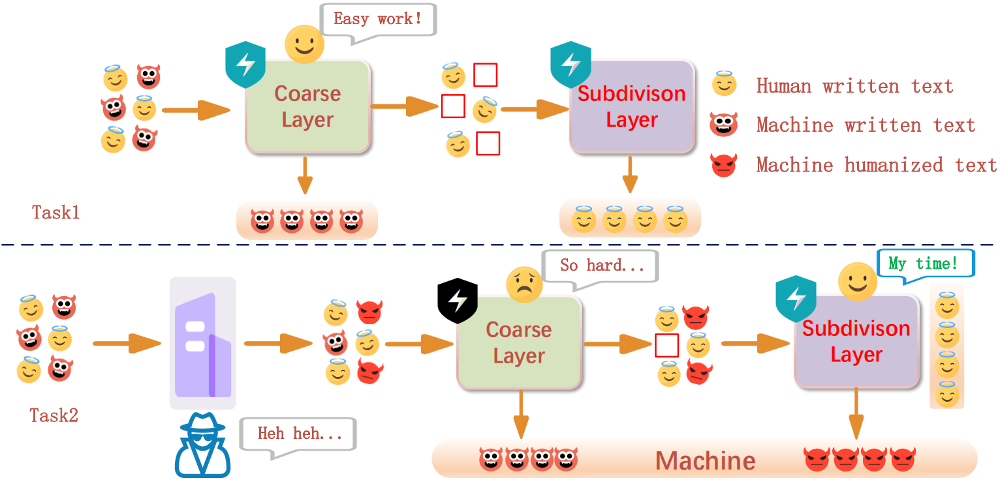
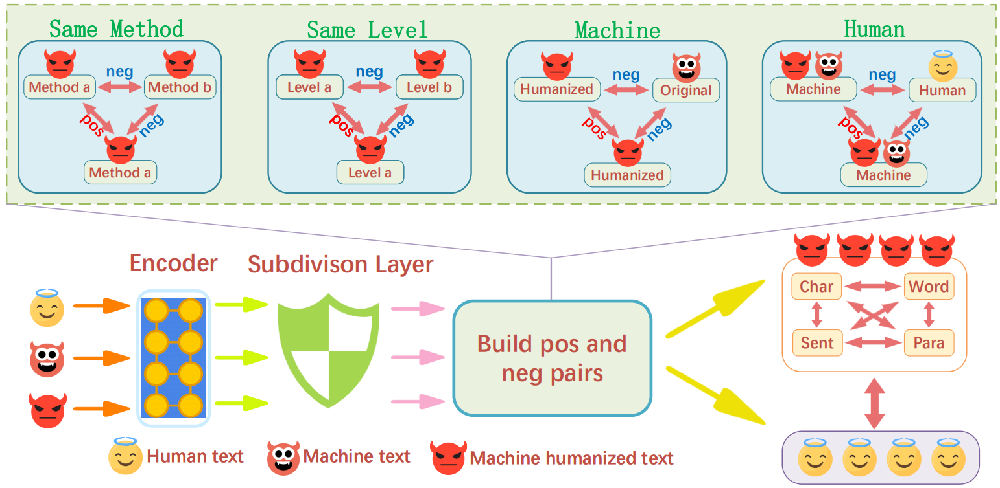

# Coarse-to-Fine-AI-Text-Detection
MGHCLD's code repository. Detailed information can see paper "Coarse-to-Fine AI Text Detection: Hierarchical
Contrastive Learning in Dual Stages". 
<div align="center">
<p align="center">
  
</p>
</div>
##Datasets
You can use our data and train MGHCLD on your own, datasets are at: (https://huggingface.co/datasets/yxyxyyx/MGHCLD_datasets)

##Pretrained Models
We also provide some of our pretrained models for you to do test,they are at: (https://huggingface.co/yxyxyyx/tempstore)

##Train
Coarse screen layer:
```bash
 python train_classifier.py --device_num 1 --per_gpu_batch_size 10 --total_epoch 30 --lr 2e-5 --warmup_steps 2000\
 --dataset HC3_origin --path MGHCLD/detect_data/HC3_origin \
     --name onlyclass-first-HC3origin  --database_name train --test_dataset_name valid --only_classifier --save_csv MGHCLD/results/detect_data/middle/train.csv --per_gpu_batch_size 8 --per_gpu_eval_batch_size 8
```
The coarse screen layer filters texts that may be real human or machine humanized, construct the filtered datasets for subdivision layer:
```bash
python tool/building_id.py --label_file MGHCLD/results/detail_result.csv --text_file MGHCLD/detect_data/checkgpt_origin/test.csv --output_dir MGHCLD/detect_data/middle/
```
<div align="center">
<p align="center">
  
</p>
</div>
Subdivision layer:
```bash
python train_classifier.py --device_num 1 --per_gpu_batch_size 8 --total_epoch 15 --lr 2e-5 --warmup_steps 600\
 --dataset middle --path MGHCLD/detect_data/middle \
     --name onlyclass-second-seqxgptattack --freeze_embedding_layer --database_name train --test_dataset_name test  --save_csv MGHCLD/results/savetrain.csv
```
We also provide you with convenient sh, see train.sh.

##Test:
Same as train, cotest.sh are available:
```bash
script/cotest.sh
```

##Patch performance
Take radar as example:
```bash
script/patchradar.sh
```
